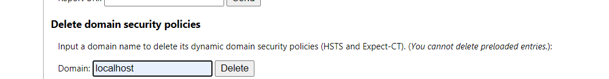

# 2021

## Edge - Stop redirect to https for localhost

edge://net-internals/#hsts



## remote: error: GH007: Your push would publish a private email address.

Go github email settings - uncheck the setting "Block ..."

## Run react app downloaded from github - npm start not working

it needs to check if needs to install the yarn

```yml
language: node_js
sudo: false
node_js:
  - stable
cache:
  directories:
    - node_modules
install:
|
  npm install -g yarn
  npm --version
  yarn

script:
  - yarn lint
  - yarn test
  - yarn coverage
```
