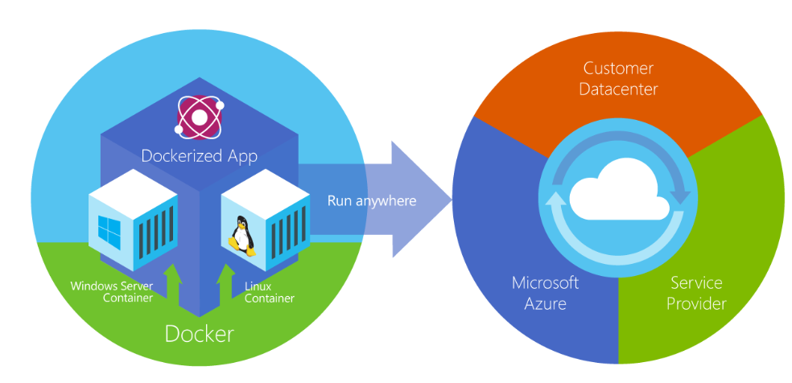
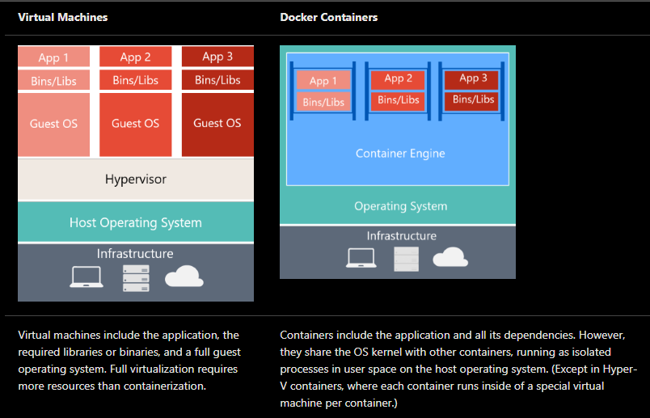
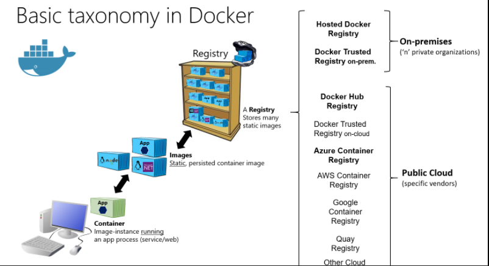

# Docker

## what is Docker

Docker is an open-source project for automating the deployment of applications as portable, self-sufficient containers that can run on the cloud or on-premises. Docker is also a company that promotes and evolves this technology, working in collaboration with cloud, Linux, and Windows vendors, including Microsoft.

Docker containers can run anywhere, on-premises in the customer datacenter, in an external service provider or in the cloud, on Azure. Docker image containers can run natively on Linux and Windows. However, Windows images can run only on Windows hosts and Linux images can run on Linux hosts and Windows hosts (using a Hyper-V Linux VM, so far), where host means a server or a VM.

## Docker containers, images, and registries

To run Windows Containers, there are two types of runtimes:

-   Windows Server Containers provide application isolation through process and namespace isolation technology. A Windows Server Container shares a kernel with the container host and with all containers running on the host.

-   Hyper-V Containers expand on the isolation provided by Windows Server Containers by running each container in a highly optimized virtual machine. In this configuration, the kernel of the container host isn't shared with the Hyper-V Containers, providing better isolation.

The images for these containers are created the same way and function the same. The difference is in how the container is created from the image running a Hyper-V Container requires an extra parameter. For details, see Hyper-V Containers.

When using Docker, a developer creates an app or service and packages it and its dependencies into a container image. An image is a static representation of the app or service and its configuration and dependencies.

To run the app or service, the app's image is instantiated to create a container, which will be running on the Docker host. Containers are initially tested in a development environment or PC.

Developers should store images in a registry, which acts as a library of images and is needed when deploying to production orchestrators. Docker maintains a public registry via Docker Hub; other vendors provide registries for different collections of images, including Azure Container Registry. Alternatively, enterprises can have a private registry on-premises for their own Docker images.

**_ Useful Links _**
https://docs.microsoft.com/en-us/dotnet/architecture/microservices/container-docker-introduction/docker-containers-images-registries
